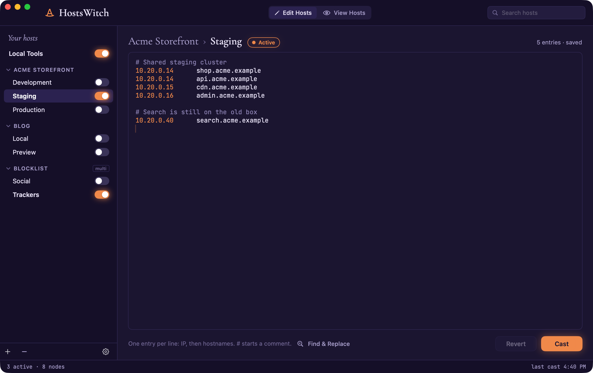
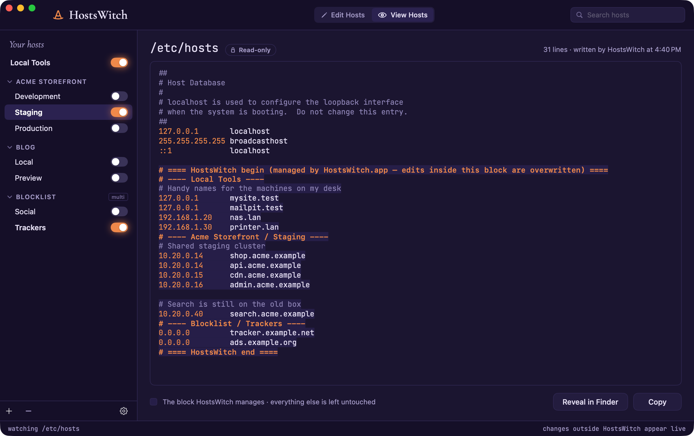
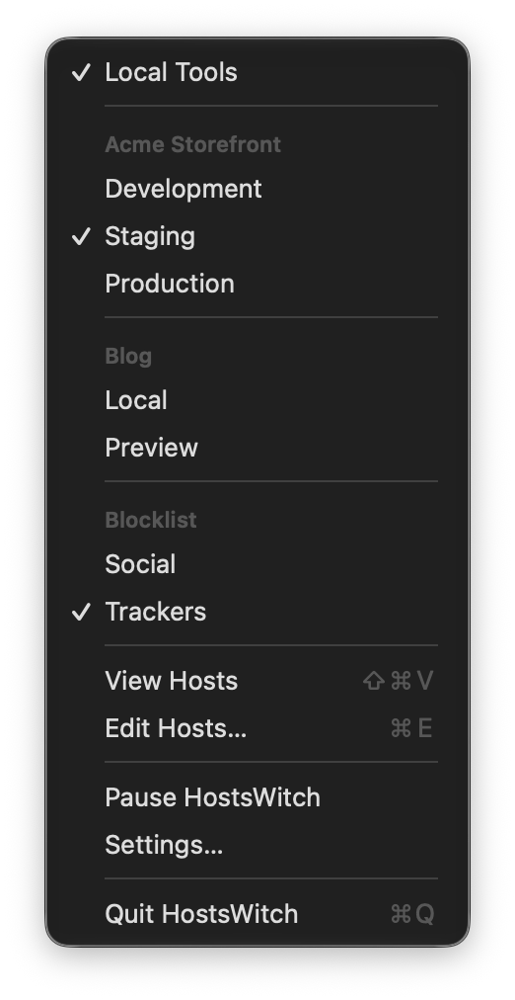

# HostsWitch

A native macOS app for managing `/etc/hosts`. It is a modern, Apple-silicon
successor to the abandoned [iHosts](https://github.com/toolinbox/iHosts),
with a witch on the broomstick.

Put your host entries into named blocks, group the ones that belong together
(development, staging, production), and switch between them from the menu
bar. HostsWitch rewrites `/etc/hosts` as you go and shows you the live file
whenever you want to check it.



## Features

- **Nodes and groups.** A *node* is a block of hosts entries you can switch
  on or off. A *group* holds several nodes, and by default only one of them
  can be on at a time: turn on *Staging* and *Development* turns off. Mark a
  group as *multi* to allow several at once, which suits things like
  blocklists.
- **Menu bar switching.** The witch's hat in the menu bar lists every node,
  with a checkmark next to the active ones. Pick one and `/etc/hosts` is
  updated immediately.
- **Edit Hosts.** Each node opens in a monospaced editor, with IP addresses
  in ember and comments dimmed. **Cast** (⌘S) saves your edits and writes
  the file, and **Revert** throws them away. **Find & Replace** (⌥⌘F) opens
  above the editor.
- **View Hosts.** A read-only view of the live `/etc/hosts`, with the section
  HostsWitch manages highlighted. It refreshes on its own when anything else
  changes the file.
- **Leaves the rest of your file alone.** HostsWitch keeps its entries in a
  single fenced block at the end of the file
  (`# ==== HostsWitch begin … end ====`) and never edits anything outside it.
  Switch every node off and the block is removed, leaving the file exactly as
  it was, byte for byte.
- **Backup.** Before its first write, HostsWitch copies the untouched file to
  `~/Library/Application Support/HostsWitch/hosts.original`. You can restore
  it from Settings.
- **Pause.** Puts `/etc/hosts` back the way the system had it while
  remembering which nodes you had on, so you can pick up where you left off.
- **Launch at login.** An option in Settings. When started this way,
  HostsWitch opens straight into the menu bar, without its window.
- **Password only when needed.** If `/etc/hosts` is owned by root, macOS asks
  for your administrator password each time HostsWitch writes it. To avoid
  that, Settings can make you the owner of `/etc/hosts` once, and hand it back
  to root later if you change your mind.

<p align="center">
  
  &nbsp;
  
</p>

### Keyboard shortcuts

| Action | Shortcut |
|--------|----------|
| New node | ⌘N |
| New group | ⇧⌘N |
| Cast (write `/etc/hosts`) | ⌘S |
| Revert edits | ⇧⌘R |
| Find & Replace | ⌥⌘F |
| Edit Hosts | ⌘E |
| View Hosts | ⇧⌘V |
| Settings | ⌘, |

Your nodes and groups are saved in
`~/Library/Application Support/HostsWitch/library.json`.

## Install

Download `HostsWitch-x.y.z.dmg` from the [Releases](../../releases) page,
open it, and drag HostsWitch to Applications. Releases are signed with a
Developer ID and notarized, so the app opens normally the first time.

## Build from source

You need macOS 14 or later and Xcode (or just the Command Line Tools).

```
./App/build-app.sh
```

This compiles the Swift package, assembles `HostsWitch.app` in the repository
root, and signs it ad hoc.

Other scripts:

- `App/make-icon.swift` regenerates the app icon:
  `swift App/make-icon.swift && iconutil -c icns AppIcon.iconset -o App/AppIcon.icns`
- `App/release.sh` builds the signed, notarized DMG. It needs the Developer
  ID certificate and an `AC_NOTARY` notarytool profile.

### Source layout

All the code is in `App/Sources/HostsWitch/`:

| File | Contents |
|------|----------|
| `App.swift` | Scenes: the main window, Settings, the menu-bar extra, menu commands |
| `Model.swift` | `HostNode`, `HostGroup`, `HostItem`, and the starter library |
| `Store.swift` | The observable library: casting, applying, file watching, persistence |
| `HostsFile.swift` | Reading the file, composing and stripping the managed block, writing directly or with admin rights |
| `HostsTextView.swift` | The `NSTextView` wrapper that colours hosts-file syntax |
| `Views.swift` | The window: top bar, sidebar, editor, viewer, and Settings |
| `Theme.swift` | The Coven palette, bundled fonts, and the hat icon |

### Screenshots

The screenshots above use made-up data from `docs/screenshots/demo/`. Two
environment variables point the app at a stand-in hosts file and library
folder, so your real `/etc/hosts` is never touched:

```
cp -R docs/screenshots/demo /tmp/hw-demo
open -n --env HOSTSWITCH_HOSTS_FILE=/tmp/hw-demo/hosts \
        --env HOSTSWITCH_SUPPORT_DIR=/tmp/hw-demo HostsWitch.app
```

## Design

The look is the *Coven* direction, chosen from five mockups (in `design/`)
laid out on one Design canvas:
<https://claude.ai/artifact/FzRAo8ewA1s1fmdzp2wtWp>

| # | Name | Look |
|---|------|------|
| 1 | Cupertino | Stock macOS: grey source list, unified toolbar, SF Mono editor. |
| 2 | Slate | Dark developer tool: graphite, cool blue, toggles in the sidebar. |
| 3 | Terminal | Monospace everything, hairline rules, forest-green accent. |
| 4 | **Coven** (shipped) | Moonlit indigo, a glowing ember accent, Cormorant Garamond titles, a witch's-hat icon, and "Cast" instead of "Apply". |
| 5 | Hearth | Parchment and candle amber, Newsreader serif, a cauldron icon. |

`design/generate.py` writes the artboards (`design/project/*.dc.html`) and
`design/project/canvas.json`. `design/render-png.sh` renders them into
`design/png/` using headless Chrome.

## License

The code is released under the MIT License. The bundled
[Cormorant Garamond](https://github.com/CatharsisFonts/Cormorant) and
[JetBrains Mono](https://github.com/JetBrains/JetBrainsMono) fonts have their
own license, the SIL Open Font License 1.1 (`App/Fonts/OFL-*.txt`).
